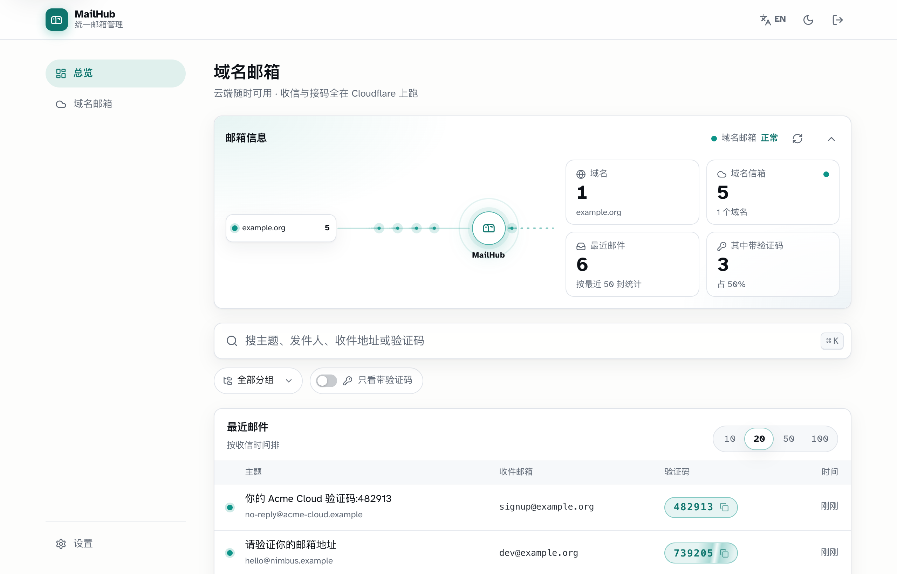
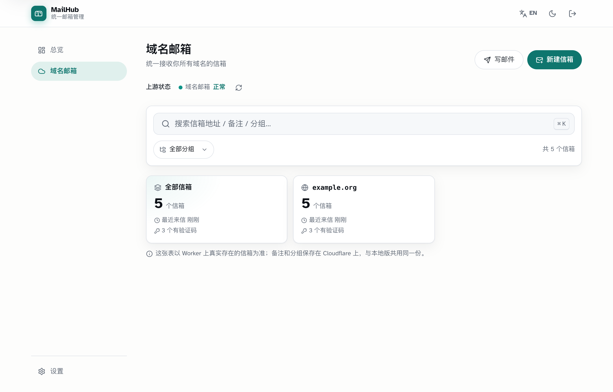
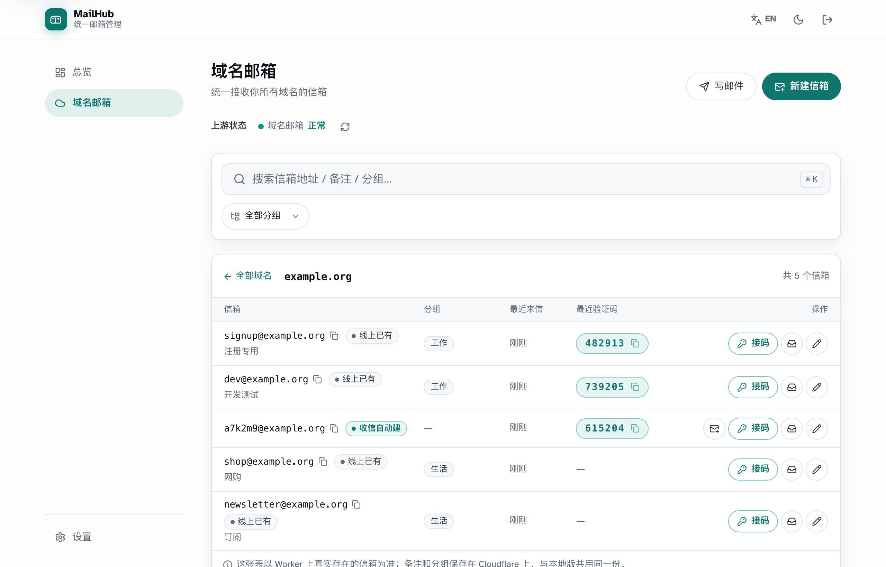
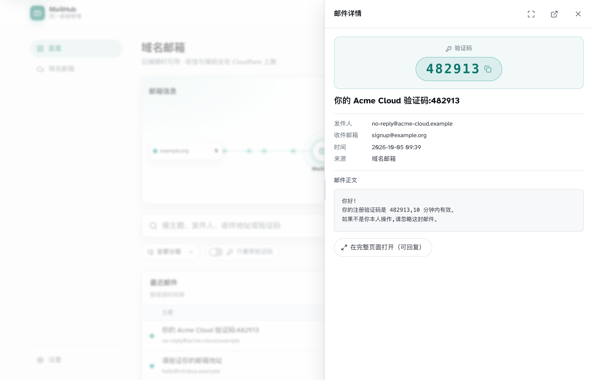
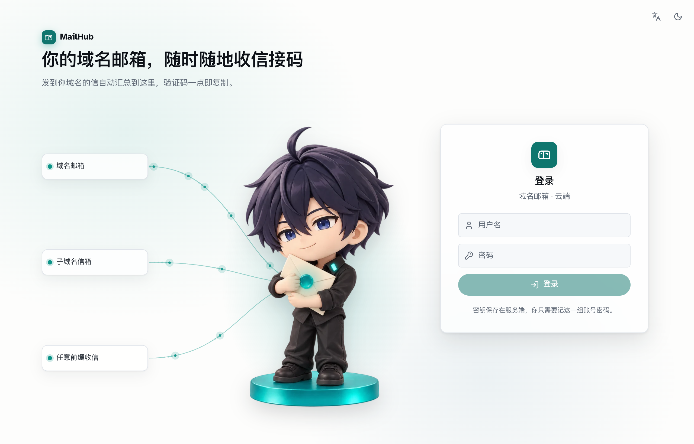
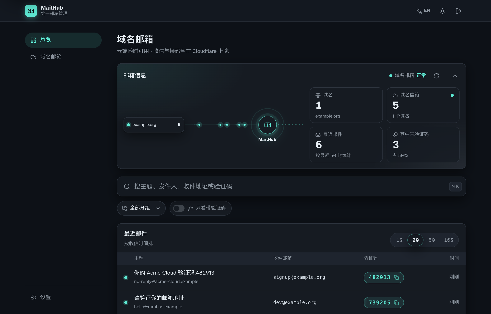
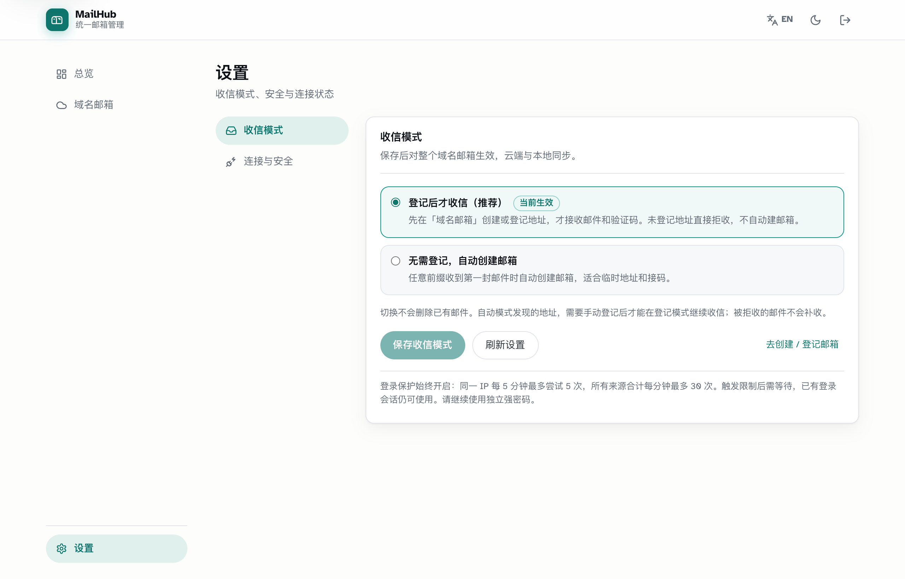
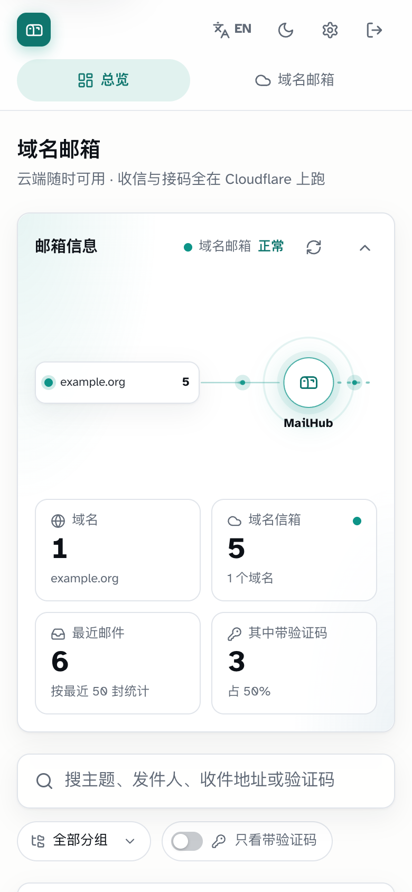

<!-- purpose: MailHub Kit 对外说明：是什么、效果截图、要准备什么、怎么交给 AI 一次搭好、日常怎么用。 -->

# MailHub Kit

**把这个仓库交给你的 AI 编程工具（Claude Code / Codex / Hermes），它会在你自己的 Cloudflare 免费账号上，从零搭好一套域名邮箱，搭到你亲自确认能用为止。**



你会得到：

- ☁️ **云端登录网页**：比如 `https://mail.你的域名`，手机、电脑随时登录收信，账号密码保护。
- 💻 **本地版**：本机一条命令启动同一个网页，只允许本机访问，免登录。
- 📮 **域名收信 + 自动提取验证码**：默认只收你登记过的地址，垃圾信建不了邮箱；也可在设置里打开「任意名字@你的域名 首次来信自动建信箱」。

不用买服务器，不用维护邮件服务器，Cloudflare 免费额度内零成本。

## 搭好之后长这样

> 截图用的是示例数据（`example.org` 下的虚构信箱与邮件）。界面和你搭好后看到的一致。

| 域名邮箱：每个域名一张卡 | 进入域名：新建、备注、分组、接码、看信 |
|---|---|
|  |  |
| **邮件详情：右侧抽屉，验证码置顶一点即复制；正文可缩放、可全屏** | **云端登录页：账号密码保护** |
|  |  |
| **深色模式** | **设置：收信模式一键切换** |
|  |  |

<p align="center"><br><sub>手机上同样好用</sub></p>

总览顶部是「汇流」动画：各个域名的来信像光点一样流进中间的枢纽；下面是可搜索、可按分组筛选、可选 10 / 20 / 50 / 100 封的最近邮件时间线，新邮件到达时会有一个信封落下的小动画。收信模式默认只收登记过的地址；需要任意名字都能直接收时，在设置里切到自动模式。

## 你需要准备

1. 一个 **Cloudflare 账号**（没有就去 https://dash.cloudflare.com 免费注册）
2. 一个**域名**（在哪买的都行；这个域名最好没在用别的邮箱）
3. 一台电脑，外加一个 AI 编程工具：Claude Code、Codex、Hermes Agent 都可以。电脑缺什么环境，AI 会帮你装。

## 怎么用：交给你的 AI，一句话搞定

打开你的 AI 编程工具，发这一句：

> 请阅读 https://github.com/xtianowner/mailhub-kit 里的 AGENTS.md，按它帮我搭建域名邮箱。

AI 会自己把项目下载到 `~/mailhub-kit`（Windows 为 `%USERPROFILE%\mailhub-kit`）。如果你已经下载或克隆过这个仓库，就把那句话里的网址换成本地文件夹。

AI 会先把自己注册成 `mailhub-setup` 技能，然后**一次性问你几个问题**：域名、登录网页地址、登录用户名、网页上用什么形象等，接着自动完成全部搭建。

这个 AI 助手是一次性的，它只有一个目标：**把你的邮箱搭建成功**。

- 中途卡住了，它会用大白话告诉你卡在哪、需要你做什么，然后换办法继续，直到搭通为止。
- 关掉工具再回来，说一句「继续搭建我的邮箱」，它会从上次停下的地方接着做。
- 搭建过程中或搭好之后，你想调整网页样式、换地址、开启附件，也可以直接跟它说。

过程中你只需要：

- 打开 AI 提供的 Cloudflare 授权入口，按提示输入设备码并点「允许」（不一定弹窗）；
- 如果域名还没接入 Cloudflare，按提示去买域名的平台改一次 NS；
- 在自己的终端窗口里设置登录密码；没有弹窗时执行 AI 提供的手动命令（密码不经过聊天）。

搭好后，请你亲自确认三件事：
1. 能用自己的密码登录网页；
2. AI 先登记 `test@你的域名`，你再用 Gmail / QQ 邮箱发一封信，通常一分钟内能在网页里看到；
3. 本地版能打开。

三件事都确认了才算完成。完成之后，日常使用就不需要 AI 助手了。

## 日常使用

| 想做什么 | 怎么做 |
|---|---|
| 启动本地版 | 运行 `./start.sh`（Windows：双击 `start.cmd`），会自动打开浏览器 |
| 停止本地版 | 运行 `./stop.sh`（Windows：双击 `stop.cmd`） |
| 切换收信模式 | 设置 → 收信模式 → 登记后收信 / 自动模式 → 保存；云端与本地共同生效 |
| 登记邮箱 | 域名邮箱 → 新建；自动模式建出来的地址可点「登记」，已有邮件保留 |
| 改登录密码 | 运行搭建完成时交付信息里那条「改登录密码」命令；或在项目根运行 `sh kit/scripts/node.sh kit/scripts/set-login.mjs`（Windows PowerShell：`powershell -ExecutionPolicy Bypass -File kit\scripts\node.ps1 kit/scripts/set-login.mjs`）。两种都用搭建时记录的 Node |
| 更新到新版本 | 跟你的 AI 说「把我的邮箱套件更新到最新版」。已有邮件、设置和密钥都会保留；每版改了什么见 [CHANGELOG.md](CHANGELOG.md) |
| 其它事 | 跟你的 AI 说，比如「启动我的邮箱」「邮箱收不到信了帮我查一下」 |

## 费用

| 项目 | 费用 |
|---|---|
| 收信、网页、数据接口、数据库 | Cloudflare 免费额度内：后台每天 10 万次请求，数据库 5GB |
| 保存附件（可选） | R2 有 10GB 免费额度，开通需要在 Cloudflare 绑定信用卡或 PayPal |
| 对外发信（默认不开） | 需要 Workers 付费版，5 美元/月 |

## 不用 AI、自己动手

需要 Node.js 22 或更高版本，推荐最新 Node 22 / 24 LTS。Windows 启动器会使用搭建时记录的 Node 路径，支持便携版，无需更换全局 Node。在项目根依次执行：

```bash
node kit/scripts/doctor.mjs                 # 环境自检
node kit/scripts/setup.mjs deps             # 安装依赖
node kit/scripts/setup.mjs init --domain example.com --web-host mail.example.com --login-user you@gmail.com
node kit/scripts/setup.mjs all              # 跑完全部步骤；遇到需要你操作的地方会停下来说明
node kit/scripts/verify.mjs                 # 全链路验收
```

每一步可重跑并复用已有资源；`all` 会依次重跑全部步骤，`status` 给出下一步，`all --from <步骤>` 可从指定步骤续跑。Windows 跑过 `configs` 后可用 `.\mailhub.cmd <步骤>`。完整说明见 `kit/skill/mailhub-setup/SKILL.md`。

## 它是怎么工作的

```
外部来信 → Cloudflare Email Routing（兜底规则）→ mailhub-inbox（收件准入、解析、提取验证码）→ D1 数据库
                                                                           ↑
浏览器 → mailhub-web（登录网关，服务端注入接口密钥）→ mailhub-api（数据接口）──┘
本机   → 同一个 mailhub-web 在本地运行（免登录，只允许本机访问）
```

| 目录 | 内容 |
|---|---|
| `kit/` | 安装器、agent 技能、离线自测；数据接口说明见 `kit/docs/data-api.md` |
| `modules/cfmail-worker/` | 收信与数据接口两个 Worker，以及数据库升级脚本 |
| `modules/unified-mail/frontend/` | 网页界面（React） |
| `modules/unified-mail/cloud/` | 登录网关 Worker |

## 安全

- 接口密钥由安装器随机生成，只存在 Cloudflare 的加密变量和你本机的 `.mailhub/`（已被 git 忽略；POSIX 文件权限 600，Windows 由目录 ACL 控制）里。浏览器永远拿不到。
- 登录密码只由你本人在终端里输入，直接加密存到 Cloudflare，本机不留副本。
- 云端网页未登录时，所有数据接口一律拒绝访问。本地免登录只对回环地址的请求生效，并拒绝跨站写入。
- 默认拒收未登记地址，减少随机收件人造成的垃圾信箱和存储增长；不能阻止发往已知地址的垃圾邮件。
- 登录使用共享数据库限速：每 IP 每 5 分钟 5 次、全部来源每分钟 30 次；达到限制返回 429，保护不可用则暂停新登录。

收信模式、地址登记和安全边界见 [收信模式与登录保护](kit/docs/mail-security.md)。

GitHub 发布资料见 [开源 Agent 发布说明](docs/github-update.md)。

## 开发者自测

```bash
cd kit && npm ci && npm test && cd ..      # 单元测试 + 离线编排测试 + 契约测试
node --test modules/cfmail-worker/tests/*.test.mjs modules/unified-mail/cloud/tests/*.test.mjs
node kit/scripts/setup.mjs build          # 本地网页的构建产物
node kit/tests/e2e-local.mjs               # 登记/自动模式 → 真实本地 D1 → 数据接口 → 网页网关
```

## 许可

- 代码：MIT。
- 作者形象（`modules/unified-mail/frontend/src/brand/xtian/` 里的手办图）：[CC BY 4.0](https://creativecommons.org/licenses/by/4.0/deed.zh-hans)。新安装默认使用，可以免费用、也可以商用，条件是保留页脚「by XTian」署名和指向作者博客的链接，详见该目录的 `LICENSE.md`。
- 不想用作者形象：安装时告诉 AI「换成我自己的形象」（它会教你生成并替换）或「不要形象」（改用通用信封插画、不显示署名）。装好以后也能随时换，见 `kit/skill/mailhub-setup/SKILL.md` 第 9 节「换形象」。
